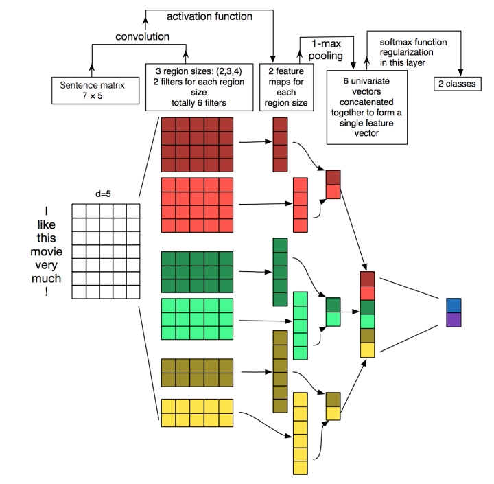

####  textcnn
* 原理：核心点在于使用卷积来捕捉局部相关性，具体到文本分类任务中可以利用CNN来提取句子中类似 n-gram 的关键信息。

* **textcnn**详细过程：第一层是图中最左边的7乘5的句子矩阵，每行是词向量，维度=5，这个可以类比为图像中的原始像素点了。然后经过不同 filter_size的一维卷积层（这里是2,3,4），每个filter_size 有filter_num（这里是2）个输出 channel。第三层是一个1-max pooling层，这样不同长度句子经过pooling层之后都能变成定长的表示了，最后接一层全连接的 softmax 层，输出每个类别的概率。
* 特征：这里的特征就是词向量，有静态（static）和非静态（non-static）方式。static方式采用比如word2vec预训练的词向量，训练过程不更新词向量，实质上属于迁移学习了，特别是数据量比较小的情况下，采用静态的词向量往往效果不错。non-static则是在训练过程中更新词向量（fine_tune）。推荐的方式是 non-static 中的 fine-tunning方式，它是以预训练（pre-train）的word2vec向量初始化词向量，训练过程中调整词向量，能加速收敛，当然如果有充足的训练数据和资源，直接随机初始化词向量效果也是可以的。
* 一维卷积（conv-1d）：图像是二维数据，经过词向量表达的文本为一维数据，因此在TextCNN卷积用的是一维卷积。一维卷积带来的问题是需要设计通过不同 filter_size 的 filter 获取不同宽度的视野。
* Pooling层：利用CNN解决文本分类问题的文章还是很多的，比如这篇 [A Convolutional Neural Network for Modelling Sentences ](https://arxiv.org/pdf/1404.2188.pdf)最有意思的输入是在 pooling 改成 **(dynamic) k-max pooling**，pooling阶段保留 k 个最大的信息，保留了全局的序列信息。比如在情感分析场景，举个例子：
```python
            “ 我觉得这个地方景色还不错，但是人也实在太多了 ”
```
虽然前半部分体现情感是正向的，全局文本表达的是偏负面的情感，利用 k-max pooling能够很好捕捉这类信息。

#### 关于数据预处理
* 使用torchtext库来进行文本处理，包括以下几个部分：
	* 分词：torchtext使用jieba分词器作为tokenizer
	* 去停用词：加载去停用词表，并在data.Field中设置
		* text = data.Field(sequential=True, lower=True, tokenize=tokenizer, stop_words=stop_words)
	* 文本长度padding：如果需要设置文本的长度，则在data.Field中设置fix_length,否则torchtext自动将文本长度处理为最大样本长度
	* 词向量转换：torchtext能自动建立word2id和id2word两个索引，并将index转换为对应词向量，如果要加载预训练词向量，在build_vocab中设置即可

#### 训练
* 如果要使用预训练词向量，则data文件夹下要存放你自己的词向量
* 随机初始化Embedding进行
```python
python train.py
```
* 使用预训练词向量进行训练（词向量静态，不可调）
```python
python train.py -static=true
```
* 微调预训练词向量进行训练（词向量动态，可调）
```python
python train.py -static=true -fine-tune=true
```