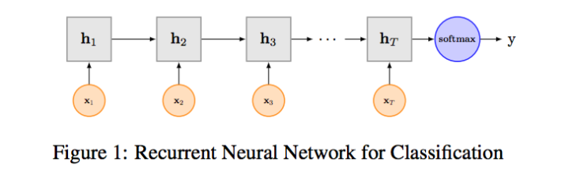
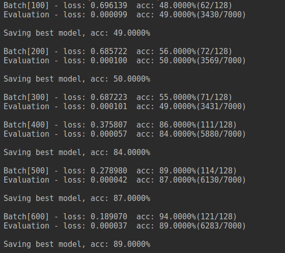

RNN是在自然语言处理领域非常标配的一个网络，在序列标注/命名体识别/seq2seq模型等很多场景都有应用，[Recurrent Neural Network for Text Classification with Multi-Task Learning](https://www.ijcai.org/Proceedings/16/Papers/408.pdf)文中介绍了RNN用于分类问题的设计，下图LSTM用于网络结构原理示意图，最后一步的隐层代表着对整个句子的编码，直接接全连接层softmax输出。


#### 关于数据预处理
* 使用torchtext库来进行文本处理，包括以下几个部分：
	* 分词：torchtext使用jieba分词器作为tokenizer
	* 去停用词：加载去停用词表，并在data.Field中设置
		* text = data.Field(sequential=True, lower=True, tokenize=tokenizer, stop_words=stop_words)
	* 文本长度padding：如果需要设置文本的长度，则在data.Field中设置fix_length,否则torchtext自动将文本长度处理为最大样本长度
	* 词向量转换：torchtext能自动建立word2id和id2word两个索引，并将index转换为对应词向量，如果要加载预训练词向量，在build_vocab中设置即可

#### 训练
* 如果要使用预训练词向量，则data文件夹下要存放你自己的词向量
* 随机初始化Embedding进行训练
```python
python train.py
```
* 随机初始化Embedding并设置是否为双向LSTM以及stack的层数
```python
python train.py -bidirectional=True -layer-num=2
```
* 使用预训练词向量进行训练（词向量静态，不可调）
```python
python train.py -static=true
```
* 微调预训练词向量进行训练（词向量动态，可调）
```python
python train.py -static=true -fine-tune=true
```

#### 关于训练结果

使用单向LSTM,可以看到，前400次迭代loss几乎没有下降，接着开始快速下降，最后验证集的准确率能到91%左右（经过调参可以更高）
